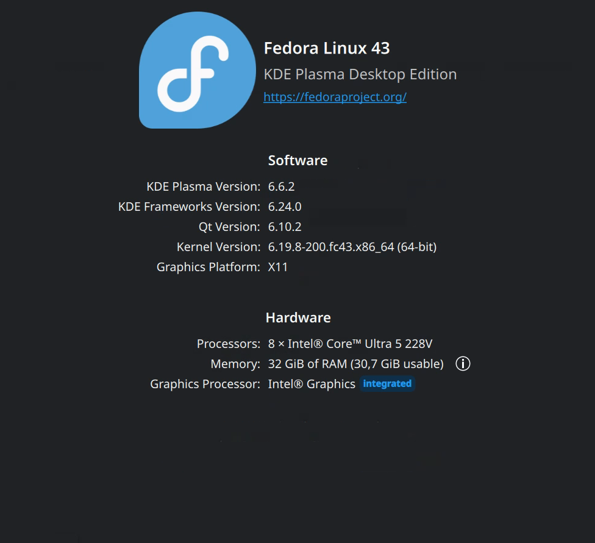
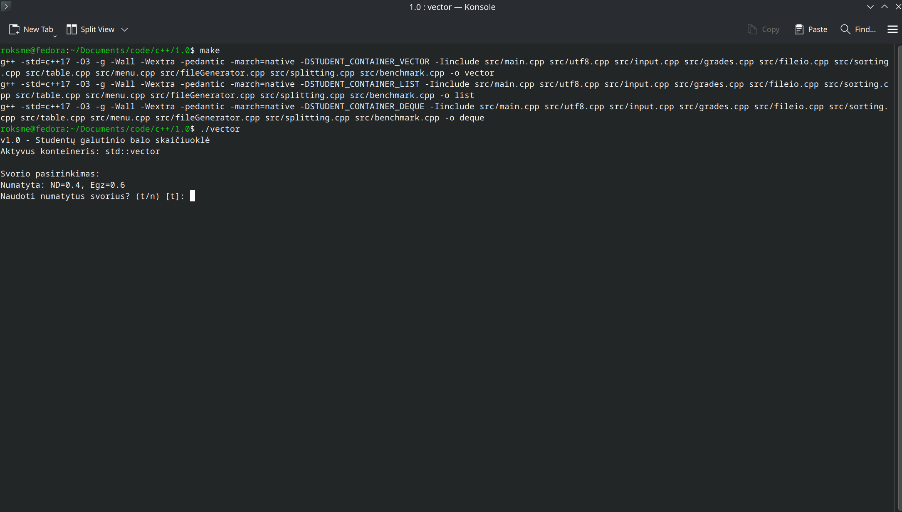
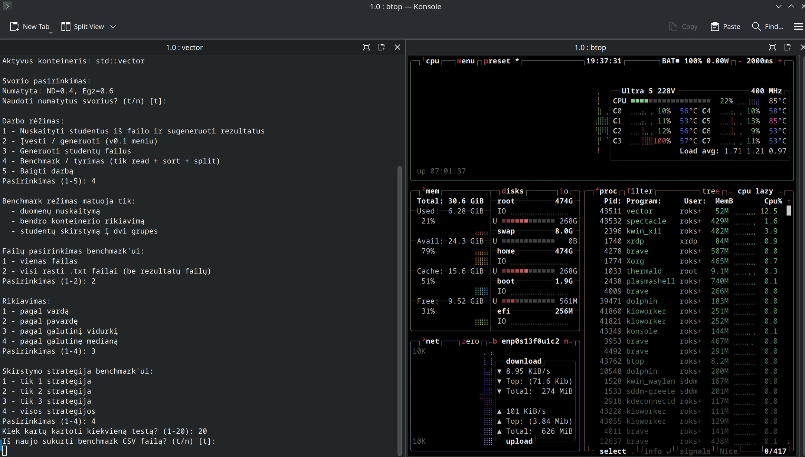
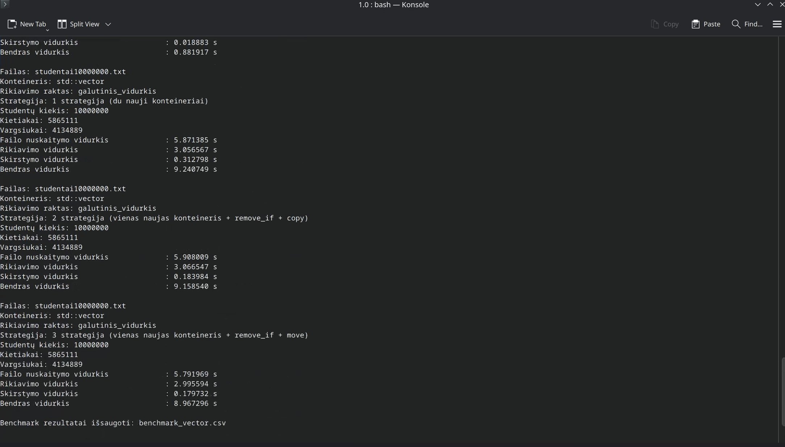
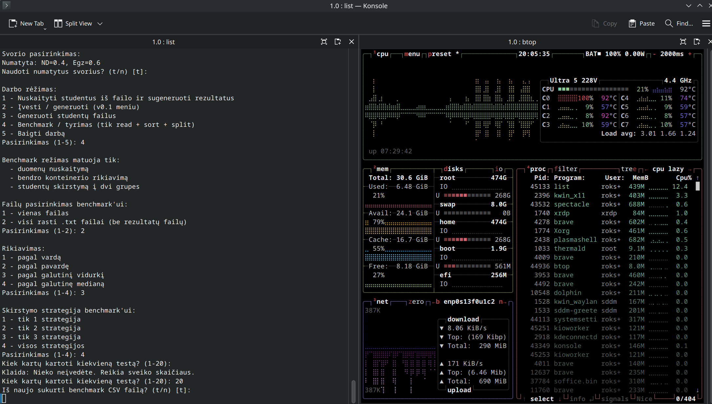
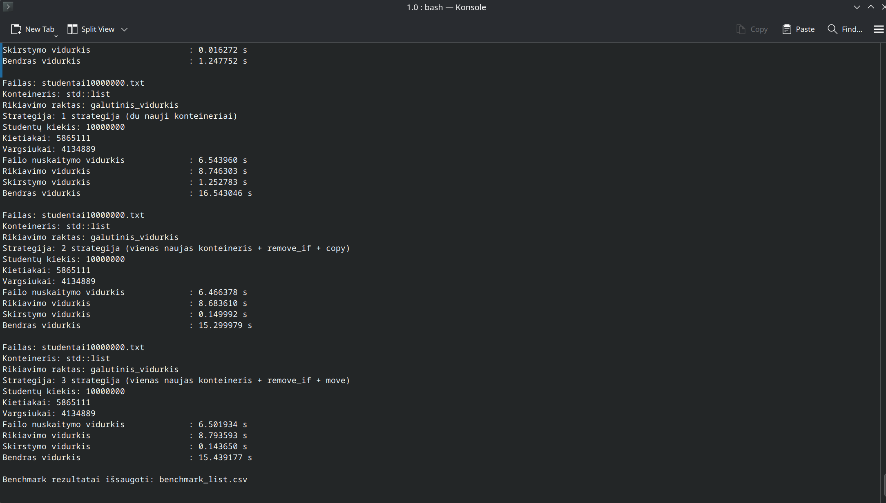
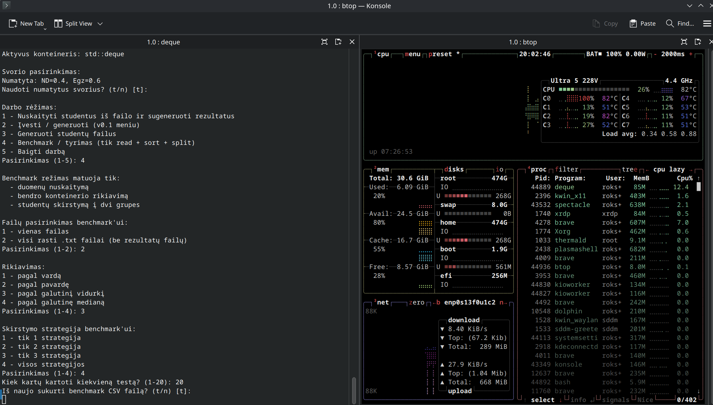
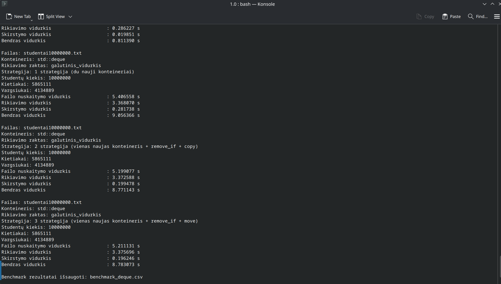

# Studentų galutinio balo skaičiuoklė – v1.0

## Trumpai apie projektą

Tai yra v1.0 projekto versija, kuri pratęsia v0.4 realizaciją ir pritaiko ją konteinerių tyrimui su trimis STL konteineriais:

- `std::vector`
- `std::list`
- `std::deque`

Programa leidžia:
- nuskaityti studentų duomenis iš failo,
- apskaičiuoti galutinį balą pagal vidurkį arba medianą,
- surūšiuoti studentus,
- padalinti juos į `kietiakai` ir `vargšiukai`,
- atlikti benchmark tyrimą, matuojant tik `read + sort + split`.

## Kas įgyvendinta v1.0

- vienas projekto kodas kompiliuojamas su trimis konteinerių tipais;
- realizuotos 3 skirstymo strategijos;
- benchmark režimas matuoja tik užduotyje reikalaujamas fazes;
- benchmark rezultatai eksportuojami į CSV failus;
- palaikomas darbas su dideliais failais, įskaitant 10 000 000 įrašų.

## Projekto struktūra

```text
.
├── include/
│   ├── benchmark.h
│   ├── constants.h
│   ├── fileGenerator.h
│   ├── fileio.h
│   ├── grades.h
│   ├── input.h
│   ├── menu.h
│   ├── sorting.h
│   ├── splitting.h
│   ├── student_container.h
│   ├── table.h
│   ├── timer.h
│   ├── types.h
│   └── utf8.h
├── src/
│   ├── benchmark.cpp
│   ├── fileGenerator.cpp
│   ├── fileio.cpp
│   ├── grades.cpp
│   ├── input.cpp
│   ├── main.cpp
│   ├── menu.cpp
│   ├── sorting.cpp
│   ├── splitting.cpp
│   ├── table.cpp
│   └── utf8.cpp
├── Makefile
└── README.md
```

## Kompiliavimas

```bash
make
```

Sugeneruojami 3 vykdomieji failai:

```bash
./vector
./list
./deque
```

Išvalymas:

```bash
make clean
```

## Paleidimas

### Įprastas režimas

Paleidus vieną iš vykdomųjų failų galima:
- nuskaityti studentus iš failo,
- įvesti duomenis ranka / generuoti per v0.1 meniu,
- generuoti testinius failus,
- išsaugoti `kietiakai.txt` ir `vargsiukai.txt`.

### Benchmark režimas

Meniu punktas:

```text
4 - Benchmark / tyrimas (tik read + sort + split)
```

Šis režimas nerašo rezultatų į `kietiakai.txt` / `vargsiukai.txt`, o matuoja tik:
- duomenų nuskaitymą,
- bendro konteinerio rūšiavimą,
- studentų skirstymą į dvi grupes.

## Testavimo duomenys

Benchmark testai atlikti su anksčiau sugeneruotais failais, kad visi konteineriai ir strategijos būtų lyginami vienodomis sąlygomis.

Naudotų failų rinkinys:
- `studentai1000.txt`
- `studentai10000.txt`
- `studentai100000.txt`
- `studentai1000000.txt`
- `studentai10000000.txt`

Šių failų atsisiuntimo nuoroda:
- https://drive.proton.me/urls/NGTEYQY8FR#gHv5pii4BrHt

## Skirstymo strategijos

### 1 strategija
Bendras studentų konteineris paliekamas nepakeistas, o duomenys kopijuojami į du naujus konteinerius:
- `kietiakai`
- `vargšiukai`

**Pliusas:** paprasta ir aiški realizacija.  
**Minusas:** didelės papildomos atminties sąnaudos.

### 2 strategija
Naudojamas vienas naujas konteineris `vargšiukai`, o silpnesni studentai pašalinami iš bendro konteinerio.

**Pliusas:** mažesnės papildomos atminties sąnaudos.  
**Minusas:** šalinimo logika yra jautri konteinerio tipui.

### 3 strategija
Trečia strategija yra optimizuota 2 strategijos versija, paremta tuo pačiu principu: sukuriamas tik vienas naujas konteineris `vargšiukai`, o bendrame konteineryje po skirstymo lieka tik `kietiakai`.

Skirtumas tas, kad vietoje paprasto duomenų kopijavimo čia naudojami efektyvesni STL veiksmai. Skirstymas atliekamas per vieną bendrą perėjimą per konteinerį, o studentai, kurie patenka į `vargšiukų` grupę, yra perkeliami į naują konteinerį naudojant `move`. Po to iš pradinio konteinerio jie pašalinami vienu bendru veiksmu. Tokiu būdu sumažinamas nereikalingas duomenų kopijavimas ir išvengiama brangių pasikartojančių trynimo operacijų.

Pagrindinė šios strategijos idėja:
- naudoti tik **vieną naują konteinerį**;
- silpnesnius studentus į jį **perkelti**, o ne kopijuoti;
- pradinį konteinerį išvalyti nuo jau atrinktų elementų **vienu bendru žingsniu**.

Toks sprendimas leidžia išlaikyti tą pačią bendrą logiką visiems konteineriams (`vector`, `list`, `deque`), bet kartu sumažina papildomų operacijų kainą. Praktikoje ši strategija dažnai duoda labai artimą arba geresnį rezultatą nei 2 strategija, ypač kai duomenų kiekis yra didelis.

**Tikslas:** sumažinti skirstymo kainą ir išlaikyti tą pačią bendrą logiką visiems konteineriams.

## Testavimo sistema

- **OS:** Fedora Linux 43, KDE Plasma Desktop Edition
- **CPU:** Intel Core Ultra 5 228V
- **RAM:** 32 GiB RAM (30.7 GiB usable)
- **Diskas:** NVMe SSD
- **Grafika:** Intel Graphics (integrated)



## Benchmark metodika

- Matuotas rikiavimas pagal `galutinis_vidurkis`
- Kiekvienas testas kartotas **20 kartų**
- Rezultatuose pateikiamas **vidurkis**
- Matuotos tik šios fazės:
  - `read`
  - `sort`
  - `split`


- [benchmark_vector.csv](results/benchmark_vector.csv)
- [benchmark_list.csv](results/benchmark_list.csv)
- [benchmark_deque.csv](results/benchmark_deque.csv)

## Strategijų palyginimas

### `std::vector`

| Failas | 1 strategija | 2 strategija | 3 strategija |
|---|---:|---:|---:|
| 1 000 | 0.001349 s | 0.000729 s | 0.000583 s |
| 10 000 | 0.006900 s | 0.006910 s | 0.006872 s |
| 100 000 | 0.078067 s | 0.076925 s | 0.076867 s |
| 1 000 000 | 0.833091 s | 0.857578 s | 0.881917 s |
| 10 000 000 | 9.186616 s | 9.063602 s | 9.571146 s |

### `std::list`

| Failas | 1 strategija | 2 strategija | 3 strategija |
|---|---:|---:|---:|
| 1 000 | 0.001219 s | 0.000618 s | 0.000545 s |
| 10 000 | 0.006112 s | 0.006368 s | 0.005994 s |
| 100 000 | 0.072899 s | 0.070519 s | 0.073526 s |
| 1 000 000 | 1.222769 s | 1.232911 s | 1.247752 s |
| 10 000 000 | 16.543046 s | 15.299979 s | 15.439177 s |

### `std::deque`

| Failas | 1 strategija | 2 strategija | 3 strategija |
|---|---:|---:|---:|
| 1 000 | 0.001302 s | 0.000738 s | 0.000595 s |
| 10 000 | 0.007000 s | 0.006903 s | 0.006755 s |
| 100 000 | 0.079334 s | 0.079797 s | 0.077361 s |
| 1 000 000 | 0.884773 s | 0.826518 s | 0.811390 s |
| 10 000 000 | 9.056366 s | 8.771143 s | 8.783073 s |

## Konteinerių palyginimas

| Failas | `vector` | `list` | `deque` |
|---|---:|---:|---:|
| 1 000 | 0.000583 s | 0.000545 s | 0.000595 s |
| 10 000 | 0.006872 s | 0.005994 s | 0.006755 s |
| 100 000 | 0.076867 s | 0.070519 s | 0.077361 s |
| 1 000 000 | 0.833091 s | 1.222769 s | 0.811390 s |
| 10 000 000 | 9.063602 s | 15.299979 s | 8.771143 s |

## Fazės pagal greičiausią strategiją

| Failas | Konteineris | Read | Sort | Split | Total |
|---|---|---:|---:|---:|---:|
| 1 000 | `vector` | 0.000476 s | 0.000095 s | 0.000012 s | 0.000583 s |
| 1 000 | `list` | 0.000473 s | 0.000064 s | 0.000008 s | 0.000545 s |
| 1 000 | `deque` | 0.000476 s | 0.000111 s | 0.000007 s | 0.000595 s |
| 10 000 | `vector` | 0.005201 s | 0.001552 s | 0.000120 s | 0.006872 s |
| 10 000 | `list` | 0.004918 s | 0.000993 s | 0.000083 s | 0.005994 s |
| 10 000 | `deque` | 0.004833 s | 0.001789 s | 0.000133 s | 0.006755 s |
| 100 000 | `vector` | 0.054990 s | 0.020075 s | 0.001803 s | 0.076867 s |
| 100 000 | `list` | 0.053860 s | 0.015315 s | 0.001343 s | 0.070519 s |
| 100 000 | `deque` | 0.051457 s | 0.024090 s | 0.001815 s | 0.077361 s |
| 1 000 000 | `vector` | 0.550995 s | 0.251998 s | 0.030097 s | 0.833091 s |
| 1 000 000 | `list` | 0.646844 s | 0.456713 s | 0.119212 s | 1.222769 s |
| 1 000 000 | `deque` | 0.505312 s | 0.286227 s | 0.019851 s | 0.811390 s |
| 10 000 000 | `vector` | 5.893578 s | 2.995026 s | 0.174998 s | 9.063602 s |
| 10 000 000 | `list` | 6.466378 s | 8.683610 s | 0.149992 s | 15.299979 s |
| 10 000 000 | `deque` | 5.199077 s | 3.372588 s | 0.199478 s | 8.771143 s |


## Rezultatų aptarimas

Iš benchmark rezultatų matyti, kad **`std::vector`** ir **`std::deque`** bendro našumo požiūriu pasirodė geriausiai, o **`std::list`** didesniuose duomenų rinkiniuose atsiliko daugiausia dėl lėto rūšiavimo. Nors `list` kai kuriais atvejais turėjo labai greitą skirstymo fazę, bendras rezultatas vis tiek buvo blogesnis, nes rūšiavimo kaštas stipriai išaugo ties `1 000 000` ir ypač ties `10 000 000` įrašų.

Pagal bendrą laiką mažesniuose rinkiniuose (`1 000`, `10 000`, `100 000`) geriausi rezultatai dažniausiai buvo labai artimi tarp visų trijų konteinerių, tačiau didėjant duomenų kiekiui pradėjo ryškėti skirtumai. Ties `1 000 000` ir `10 000 000` įrašų geriausius rezultatus parodė **`std::deque`**, o **`std::vector`** nuo jo atsiliko labai nedaug. Tai rodo, kad abu šie konteineriai yra tinkamiausi darbui su dideliais duomenų kiekiais.

Strategijų palyginimas parodė, kad vieno universalaus laimėtojo visais atvejais nėra, tačiau **1 strategija** dažniau buvo lėtesnė, nes ji kuria du naujus konteinerius ir dubliuoja duomenis. **2 strategija** daugeliu atvejų davė labai gerą rezultatą, ypač su `list` ir `deque`, o **3 strategija** kai kuriais atvejais buvo greičiausia, ypač `vector` ir mažesniuose rinkiniuose. Vis dėlto skirtumas tarp 2 ir 3 strategijų dažnai buvo nedidelis, todėl praktikoje jų našumas yra panašus.

Apibendrinant galima teigti, kad:
- **`std::vector`** išliko labai stiprus ir stabilus pasirinkimas;
- **`std::list`** nėra palankus variantas, kai svarbus bendras veikimo laikas ir reikia efektyvaus rūšiavimo;
- **`std::deque`** parodė geriausią bendrą rezultatą didžiausiuose testuose;
- efektyvesnės buvo tos strategijos, kurios mažino papildomą kopijavimą ir nereikalingą duomenų dubliavimą.

## Ekrano nuotraukos

Programos paleidimas:


`std::vector` benchmark:



`std::list` benchmark:



`std::deque` benchmark:



## v0.4 ir v1.0 skirtumai

### v0.4
- viena realizacija su `std::vector`
- duomenų skaitymas, skirstymas, rūšiavimas ir išvedimas į failus
- matuojamas bendras programos veikimo laikas

### v1.0
- tas pats kodas kompiliuojamas su `std::vector`, `std::list` ir `std::deque`
- pridėtas atskiras benchmark režimas pagal užduoties reikalavimus
- realizuotos 3 skirstymo strategijos
- rezultatai eksportuojami į CSV, todėl juos lengva pridėti į GitHub ir panaudoti README analizėje

## Naudojimo instrukcija

1. Sukompiliuoti projektą su `make`.
2. Paleisti vieną iš vykdomųjų failų: `./vector`, `./list` arba `./deque`.
3. Jei reikia, sugeneruoti testinius failus.
4. Paleisti benchmark režimą.
5. Surinkti CSV rezultatus.
6. Įkelti README, CSV ir ekrano nuotraukas į GitHub repozitoriją.
