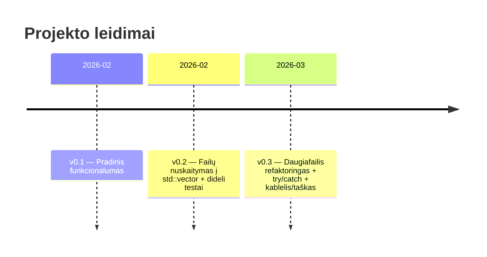

# Studentų galutinio balo skaičiuoklė (C++17) – v0.3

## Vykdomoji santrauka

**v0.3** – C++17 konsolinė programa, kuri **nuskaito studentų duomenis iš failo į `std::vector`**, apskaičiuoja **galutinį pažymį** pagal pasirinktą metodą (**vidurkį** arba **medianą**) ir pateikia rezultatų lentelę (ekrane arba faile – priklausomai nuo realizacijos). Pagrindiniai v0.3 akcentai: **daugiafailė projekto struktūra** (`include/*.h`, `src/*.cpp`, `Makefile`) ir **minimalus, bet tikslingas `try/catch` panaudojimas** failų I/O bei įvesties validacijai. Papildomai numatyta **realiųjų skaičių įvestis su kableliu arba tašku** (`0,4` ≙ `0.4`).

> Licencija: **nenurodyta** (jei kurso reikalavimai nenumato kitaip).

## Projekto paskirtis ir funkcijos

Programa skirta apdoroti studentų pažymius ir apskaičiuoti galutinį balą pagal formulę:

- **Pagal vidurkį**: `Galutinis = 0.4 * vidurkis(ND) + 0.6 * egzaminas`
- **Pagal medianą**: `Galutinis = 0.4 * mediana(ND) + 0.6 * egzaminas`

Įgyvendintos (arba šioje versijoje numatytos) galimybės:

- Nuskaitymas iš failo į `std::vector<Student>`.
- Skaičiavimo metodo pasirinkimas: vidurkis arba mediana.
- Klaidos valdomos per išimtis / validaciją: neteisingas failas, neteisinga įvestis, neteisingas formatas.
- (Jei pateikti) testiniai failai: `studentai10000.txt`, `studentai100000.txt`, `studentai1000000.txt` ir pan.
- Realiųjų skaičių parseris priima `,` arba `.` (pvz., svoriams ar kitiems realiesiems, jei įvedami).

## Projekto struktūra

Tipinė v0.3 struktūra (atnaujinkite, jei jūsų failai vadinasi kitaip):

```text
.
├── include/                 # deklaracijos (.h)
│   ├── constants.h
│   ├── types.h              # struct Student
│   ├── input.h              # įvesties validacija
│   ├── grades.h             # vidurkis/mediana/galutinis
│   ├── fileio.h             # nuskaitymas iš failo
│   ├── sorting.h            # rikiavimas (jei taikoma)
│   ├── table.h              # spausdinimas/formatavimas
│   └── menu.h               # meniu (jei taikoma)
├── src/                     # realizacijos (.cpp)
│   ├── main.cpp
│   ├── utf8.cpp
│   ├── input.cpp
│   ├── grades.cpp
│   ├── fileio.cpp
│   ├── sorting.cpp
│   ├── table.cpp
│   └── menu.cpp
├── Makefile
└── README.md
```

## Kompiliavimas

### Kompiliavimas su Makefile

Pagal pateiktą `Makefile`:

- kompiliatorius: `g++`
- vėliavos: `-std=c++17 -O2 -g -Wall -Wextra -pedantic`
- include kelias: `-Iinclude`
- sukompiliuotas binaras: **`vector`** (Makefile `TARGET := vector`)

Kompiliavimas ir paleidimas:

```bash
make
./vector
```

Išvalymas:

```bash
make clean
```

### Kompiliavimas su g++

Jei kompiliuojate be Makefile, ekvivalentinė komanda:

```bash
g++ -std=c++17 -O2 -g -Wall -Wextra -pedantic -Iinclude \
  src/main.cpp src/utf8.cpp src/input.cpp src/grades.cpp src/fileio.cpp src/sorting.cpp src/table.cpp src/menu.cpp \
  -o vector
```

> Jei binaro pavadinimą pasikeisite, vietoje `vector` naudokite `<programos_vardas>`.

## Naudojimas ir įvesties formatas

### Paleidimas

```bash
./vector
```

Programa dažniausiai veikia interaktyviai (meniu). Tipinis scenarijus:

```text
1 - Nuskaityti iš failo
2 - Įvesti / generuoti
Pasirinkimas: 1
Failas: kursiokai.txt
Metodas: 1-Vidurkis / 2-Mediana
```

### Failo formatas `kursiokai.txt`

Failo eilutės struktūra:

- `Vardas Pavardė ND1 ND2 ... NDn Egz`

Pavyzdys:

```text
Vardas Pavarde ND1 ND2 ND3 Egz
Arvydas Sabonis 8 9 10 9
Rimas Kurtinaitis 7 10 8 6
Ieva Sabonytė 10 10 10 10
```

### Pavyzdinis rezultato išvedimas

Formatas priklauso nuo jūsų lentelės realizacijos; pavyzdys:

```text
Vardas        Pavardė              Galutinis (Vid.)   Galutinis (Med.)
----------------------------------------------------------------------
Arvydas       Sabonis                     9.00               9.00
Rimas         Kurtinaitis                 6.93               6.80
Ieva          Sabonytė                   10.00              10.00
```

## Testavimas

### Testavimas su pateiktais failais

Jei turite didelius failus (pvz., `studentai10000.txt`), rekomenduojama:

1. Paleisti programą.
2. Pasirinkti nuskaitymą iš failo.
3. Nurodyti vieną iš testinių failų.
4. Pasirinkti metodą (vidurkis / mediana).
5. (Jei realizuota) išvesti į failą, kad ekranas nebūtų perkrautas.

**Ko tikėtis sėkmės atveju:**
- išvedama lentelė su antrašte ir studentų eilutėmis;
- galutiniai balai pateikti su 2 skaitmenimis po kablelio (pvz., `8.76`);
- jei pasirenkamas išvedimas į failą – sukuriamas `<rezultatu_failas>.txt` (konkretus pavadinimas gali skirtis).

### Našumo matavimas (nebūtina)

Linux/macOS:

```bash
time ./vector
```

## Klaidų apdorojimas ir išimtys

v0.3 tikslas – kad programa būtų atspari blogai įvesčiai:

- **Failų I/O**: jei failo nepavyksta atidaryti / nuskaityti, metama išimtis (pvz., `std::runtime_error`), sugaunama aukštesniame lygyje ir vartotojas informuojamas.
- **Formatas**: jei faile randamas neteisingas įrašas (pvz., raidė vietoj pažymio), pateikiamas pranešimas ir apdorojimas baigiamas aiškiai (be „crash“).
- **Įvesties validacija**: jei vartotojas įveda neteisingą reikšmę, programa paprašo įvesti pakartotinai.
- **Kablelis/taškas realiems**: įvedus `0,4`, programa jį interpretuoja kaip `0.4` (jei svoriai/realieji naudojami įvestyje).

Pavyzdiniai (orientaciniai) pranešimai:

```text
Klaida: nepavyko atidaryti failo 'studentaiX.txt'. Patikrinkite pavadinimą ir bandykite dar kartą.
Klaida: įvestis turi būti sveikas skaičius (pvz., 1 arba 2). Bandykite dar kartą.
```

## Versijos, Git workflow ir release

### Versijų palyginimas

| Versija | Pagrindiniai pokyčiai | Rezultatas |
|---|---|---|
| v0.1 | Bazinis funkcionalumas (įvedimas/skaičiavimas/išvedimas) | Veikiantis prototipas |
| v0.2 | Nuskaitymas iš failo į `std::vector`, testai su dideliais failais | Darbas su failais ir didesniais duomenimis |
| v0.3 | Daugiafailė struktūra + `try/catch` I/O ir įvesties validacijai + `,`/`.` realiems | Aiškesnė architektūra ir stabilumas |

### Kas pasikeitė v0.3 lyginant su v0.2

- Kodas išskaidytas į deklaracijas (`include/*.h`) ir realizacijas (`src/*.cpp`).
- Įdėtas išimčių valdymas: failų atidarymui ir įvesties tikrinimui.
- Parseris toleruoja `0,4` ir `0.4` (jei įvedami realieji).

### Šaka ir release kūrimas

```bash
git checkout v0.2
git checkout -b v0.3

git add .
git commit -m "v0.3: multi-file refactor + exception handling"
git push -u origin v0.3
```

Tag + release pagrindas:

```bash
git tag -a v0.3 -m "v0.3 release"
git push origin v0.3
```

### Mermaid laiko juosta



## README išsaugojimas ir įkėlimas į GitHub

> Atsisiuntimo nuorodos šiame README sąmoningai nededu, kad failas būtų švarus pateikimui į kursinį repozitoriumą. Žemiau – tikslūs žingsniai susikurti `README.md` lokaliai ir įkelti.

### Išsaugoti kaip `README.md`

1. Projekto šaknyje sukurkite failą `README.md`.
2. Įklijuokite šį turinį.
3. Išsaugokite.

### Įkėlimas per GitHub Web UI

1. GitHub’e atsidarykite repozitoriumą ir pasirinkite šaką `v0.3`.
2. **Add file → Create new file** (arba **Upload files**).
3. Pavadinimas: `README.md`.
4. Įklijuokite turinį → **Commit changes**.

### Įkėlimas per `git` komandas

```bash
git checkout v0.3
git add README.md
git commit -m "docs: add/update README for v0.3"
git push
```

## Kodavimo stilius ir tolesni patobulinimai

Trumpai apie stilių:

- Standartas: **C++17** (`-std=c++17`).
- `.h` – deklaracijos / tipai, `.cpp` – realizacijos.
- Rekomenduojami įspėjimai: `-Wall -Wextra -pedantic` (jau yra Makefile).
- Lentelių formatavimui: `iomanip` (`setw`, `left`, `fixed`, `setprecision(2)`).

Idėjos patobulinimams:

- CLI argumentai (pvz., `--input`, `--output`, `--mode vid|med`) automatiniam testavimui.
- Vienetiniai testai medianai/vidurkiui/parseriui.
- `std::filesystem` failų tikrinimui ir kelių valdymui.
- Našumo optimizacijos (`vector.reserve()`, mažiau kopijavimo, išvedimas į failą dideliems duomenims).

## Patikros sąrašas prieš pateikimą

- [ ] Šaka `v0.3` sukelta į GitHub (`git push -u origin v0.3`).
- [ ] Sukurtas tag `v0.3` ir GitHub release.
- [ ] Repozitoriume yra `Makefile`.
- [ ] Yra `include/` ir `src/` katalogai (daugiafailė struktūra).
- [ ] Programą pavyksta sukompiliuoti (`make`) ir paleisti (`./vector` arba `./<programos_vardas>`).
- [ ] Testiniai failai (`studentai10000.txt` ir pan.) yra prieinami pagal kurso reikalavimus.
- [ ] Klaidos (failas neegzistuoja / bloga įvestis) apdorojamos be programos nulūžimo.
