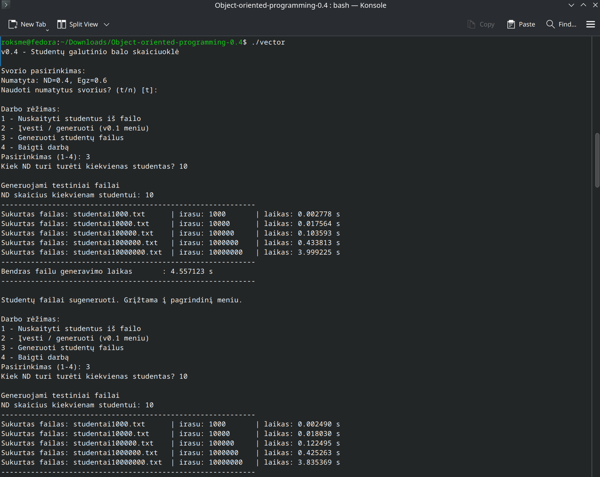
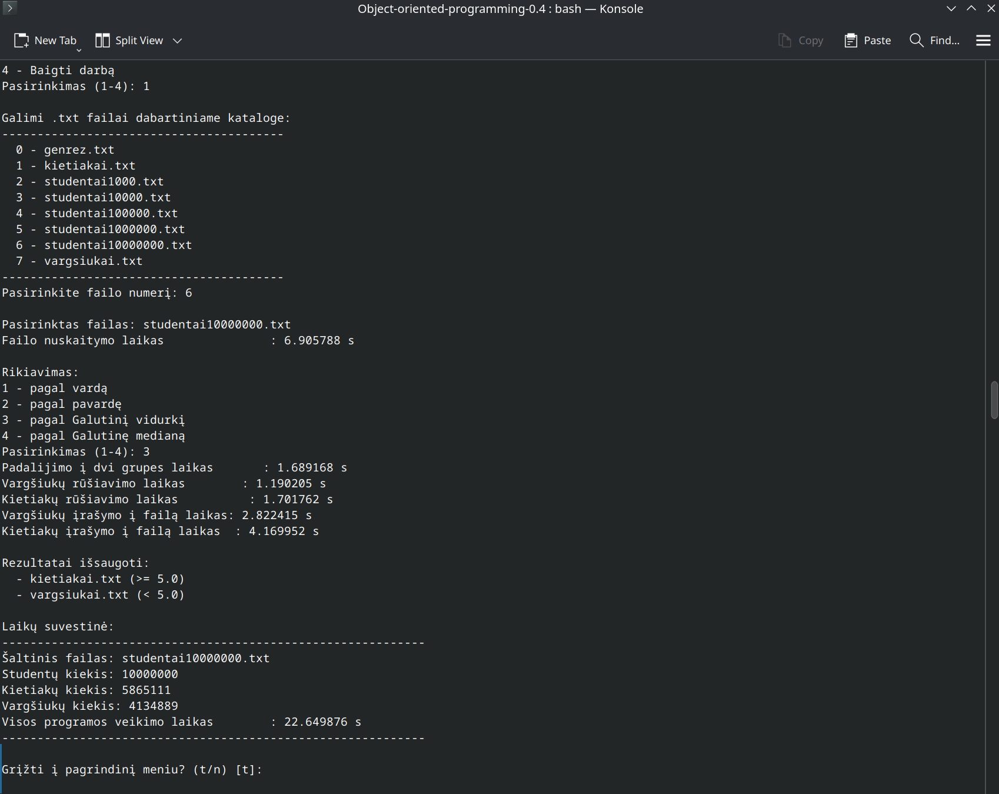

# Studentų galutinio balo skaičiuoklė (C++17) – v0.4

## Vykdomoji santrauka

**v0.4** – C++17 konsolinė programa, kuri:

- generuoja didelius studentų duomenų failus
- nuskaito studentų duomenis iš failo
- apskaičiuoja galutinį pažymį
- padalina studentus į dvi kategorijas
- surūšiuoja rezultatus
- įrašo rezultatus į atskirus failus
- matuoja programos veikimo laiką

---

# Projekto paskirtis ir funkcijos

Programa skirta apdoroti studentų pažymius ir apskaičiuoti galutinį balą pagal formulę.

### Pagal vidurkį

```
Galutinis = 0.4 * vidurkis(ND) + 0.6 * egzaminas
```

### Pagal medianą

```
Galutinis = 0.4 * mediana(ND) + 0.6 * egzaminas
```

---

# Įgyvendintos funkcijos

- Nuskaitymas iš failo į `std::vector<Student>`
- Studentų failų generatorius
- Studentų padalinimas į dvi kategorijas
- Studentų rikiavimas
- Rezultatų įrašymas į failus
- Programos veikimo laikų matavimas
- Automatinis `.txt` failų aptikimas kataloge
- Patogus vartotojo meniu

---

# Studentų kategorijos

## Vargšiukai

Studentai, kurių galutinis balas:

```
< 5.0
```

Rezultatai įrašomi į failą:

```
vargsiukai.txt
```

---

## Kietiakai

Studentai, kurių galutinis balas:

```
>= 5.0
```

Rezultatai įrašomi į failą:

```
kietiakai.txt
```

---

# Projekto struktūra

```text
.
├── include/
│   ├── constants.h
│   ├── fileGenerator.h
│   ├── fileio.h
│   ├── grades.h
│   ├── input.h
│   ├── menu.h
│   ├── sorting.h
│   ├── table.h
│   ├── timer.h
│   ├── types.h
│   └── utf8.h
│
├── src/
│   ├── main.cpp
│   ├── fileGenerator.cpp
│   ├── fileio.cpp
│   ├── grades.cpp
│   ├── input.cpp
│   ├── menu.cpp
│   ├── sorting.cpp
│   ├── table.cpp
│   └── utf8.cpp
│
├── Makefile
└── README.md
```

---

# Kompiliavimas

## Naudojant Makefile

```bash
make
```

Programa paleidžiama:

```bash
./vector
```

Išvalymas:

```bash
make clean
```

---

# Programos meniu

Programa pateikia vartotojui tokį meniu:

```
Darbo rėžimas:
1 - Nuskaityti studentus iš failo
2 - Įvesti / generuoti (v0.1 meniu)
3 - Generuoti studentų failus
4 - Baigti darbą
```

---

# Testinių failų generavimas



Programa generuoja 5 skirtingų dydžių failus.

| Failas | Įrašų skaičius |
|------|------|
| studentai1000.txt | 1 000 |
| studentai10000.txt | 10 000 |
| studentai100000.txt | 100 000 |
| studentai1000000.txt | 1 000 000 |
| studentai10000000.txt | 10 000 000 |

Vardai generuojami automatiškai:

```
Vardas1 Pavarde1
Vardas2 Pavarde2
```

---

# Spartos analizė

Programa matuoja laiką šioms operacijoms:

- failo generavimui
- failo nuskaitymui
- studentų padalinimui
- studentų rūšiavimui
- rezultatų įrašymui į failus
- visos programos veikimo laikui

---

# Failų generavimo testų rezultatai

Vidurkiai iš 10 testų.

| Failas | Įrašai | Vidutinis generavimo laikas |
|------|------|------|
| studentai1000 | 1000 | ~0.0029 s |
| studentai10000 | 10000 | ~0.017 s |
| studentai100000 | 100000 | ~0.11 s |
| studentai1000000 | 1000000 | ~0.44 s |
| studentai10000000 | 10000000 | ~3.87 s |

Bendras vidutinis generavimo laikas:

```
~4.45 s
```

---

# Duomenų apdorojimo rezultatai (10M įrašų)



Testuotas failas:

```
studentai10000000.txt
```

| Veiksmas | Vidutinis laikas |
|------|------|
| Failo nuskaitymas | ~6.88 s |
| Studentų padalinimas | ~1.69 s |
| Vargšiukų rūšiavimas | ~1.19 s |
| Kietiakų rūšiavimas | ~1.70 s |
| Vargšiukų įrašymas | ~2.81 s |
| Kietiakų įrašymas | ~4.06 s |
| Visos programos laikas | ~21.58 s |

Studentų pasiskirstymas:

| Grupė | Kiekis |
|------|------|
| Kietiakai | 5 865 111 |
| Vargšiukai | 4 134 889 |

---

# Išvados

Programa pilnai įgyvendina **v0.4 reikalavimus**:

- generuoja testinius failus
- padalina studentus į dvi kategorijas
- rūšiuoja duomenis
- įrašo rezultatus į failus
- matuoja veikimo laiką
- stabiliai veikia su **10 milijonų įrašų**

Didžiausią laiko dalį sudaro:

- failų nuskaitymas
- rezultatų įrašymas į failus

Tai yra normalu, nes **I/O operacijos yra lėčiausios**.

---

# Versijų istorija

| Versija | Aprašymas |
|------|------|
| v0.1 | Pradinė studentų skaičiavimo programa |
| v0.2 | Failų nuskaitymas |
| v0.3 | Projekto refaktoringas + try/catch |
| v0.4 | Failų generatorius + spartos analizė + studentų kategorijos |

---
